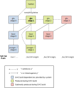

Hadrian
=======

Hadrian is a new build system for the [Glasgow Haskell Compiler][ghc]. It is
based on the [Shake][shake] library and we hope that it will replace the current
[Make-based build system][make] starting from GHC 8.8. If you are curious about
the rationale behind the
project and the architecture of the build system you can find more details in
this [Haskell Symposium 2016 paper](https://dl.acm.org/authorize?N41275) and this
[Haskell eXchange 2016 talk][talk].

The new build system can work side-by-side with the existing build system, since it
places all build artefacts in a dedicated directory (called `_build` by default).

Your first build
----------------

Hadrian has not entirely caught up with the Make build system. Not afraid?
Then put on the helmet and run the following commands from the root of the GHC
tree:

```
./boot && ./configure
hadrian/build -j
```

or on Windows:

```
./boot && ./configure --enable-tarballs-autodownload
hadrian/build.bat -j
```

Here flag `-j` enables parallelism and is optional. We will further refer to the
build script simply as `build`. Note that Hadrian can also run the `boot` and
`configure` scripts automatically for you if you pass the flag `--configure`,
or simply `-c`. See the overview of command line flags below.

Notes:

* If the default build script doesn't work, you might want to try another one,
e.g. based on Cabal sandboxes (`build-cabal.*`), Stack (`build-stack.*`) or Nix
(`build-stack-nix.*`).

* On Windows, if you do not want to install MSYS, you can use the Stack-based
build script (Stack provides a managed MSYS environment), as described in
[these instructions][windows-build]. If you don't mind installing MSYS yourself
or already have it, you can use the Cabal-based build script.

* Hadrian is written in Haskell and depends on `shake` (plus a few packages that
`shake` depends on), `mtl`, `quickcheck`, and GHC core libraries.

* If you have never built GHC before, start with the
[preparation guide][ghc-preparation].

Cheatsheet for Make users
-------------------------

You can find a cheatsheet-style document that shows the Hadrian equivalents of
commands that GHC users are used to run with the Make build system
[here](doc/make.md).

Using the build system
----------------------
Once your first build is successful, simply run `build` to rebuild after some
changes. Build results are placed into `_build` by default.

#### Command line flags

In addition to standard Shake flags (try `--help`), the build system
currently supports several others:

* `--build-root=PATH` or `-oPATH`: specify the directory in which you want to
store all build products. By default Hadrian builds everything in the `_build/`
subdirectory of the GHC source tree. Unlike the Make build system, Hadrian
doesn't have any "inplace" logic left any more. This option is therefore useful
for GHC developers who want to build GHC in different ways or at different
commits, from the same source directory, and have the build products sit in
different, isolated folders.

* `--configure` or `-c`: use this flag to run the `boot` and `configure` scripts
automatically, so that you don't have to remember to run them manually as you
normally do when using Make (typically only in the first build):
    ```bash
    ./boot
    ./configure # On Windows run ./configure --enable-tarballs-autodownload
    ```
    Beware that with this flag Hadrian may do network I/O on Windows to download
    necessary tarballs, which may sometimes be undesirable.

* `--flavour=FLAVOUR`: choose a build flavour. The following settings are
currently supported: `default`, `quick`, `quickest`, `perf`, `prof`, `devel1`
and `devel2`. As an example, the `quickest` flavour adds `-O0` flag to all GHC
invocations and builds libraries only in the `vanilla` way, which speeds up
builds by 3-4x. Build flavours are documented
[here](https://gitlab.haskell.org/ghc/ghc/blob/master/hadrian/doc/flavours.md).

* `--freeze1`: freeze Stage1 GHC, i.e. do not rebuild it even if some of its
source files are out-of-date. This allows to significantly reduce the rebuild
time when you are working on a feature that affects both Stage1 and Stage2
compilers, but may lead to incorrect build results. To unfreeze Stage1 GHC
simply drop the `--freeze1` flag and Hadrian will rebuild all out-of-date files.

* `--freeze2`: just like `--freeze1` but tell Hadrian to additionally freeze
Stage2 GHC.

* `--integer-simple`: build GHC using the `integer-simple` integer library
(instead of `integer-gmp`).

* `--color` and `--no-color`: choose whether to use colors when printing build
progress info. By default, Hadrian tries to determine if the terminal supports
colored output, and proceeds accordingly.

* `--progress-info=STYLE`: choose how build progress info is printed. There are
four settings: `none`, `brief` (one line per build command; this is the default
setting), `normal` (typically a box per build command), and `unicorn` (when
`normal` just won't do).

* `--verbose`: run Hadrian in verbose mode. In particular this prints diagnostic
messages by Shake oracles.

* `--lint`: run [Shake Lint](https://shakebuild.com/manual#lint) during the
build to check that the build system is well formed. Note that the Lint check
currently fails under certain circumstances, as discussed in
[this ticket](https://gitlab.haskell.org/ghc/ghc/issues/15971).

#### Expressions

Hadrian expressions are used extensively for specifying build settings. For an
explanation of how they work, see the [documentation](doc/expressions.md).

#### User settings

The Make-based build system uses `mk/build.mk` to specify user build settings.
Hadrian uses `hadrian/UserSettings.hs` for the same purpose, see
[documentation](doc/user-settings.md).

#### Building libraries and executables

You can build a specific library or executable for a given stage by running
`build stage<N>:<lib|exe>:<package name>`. Examples:

```sh
# Build the Stage1 GHC compiler, and place the binary to the directory
# _build/stage0/bin/ghc (because it is built by the Stage0 compiler).
build stage1:exe:ghc-bin

# Build the Stage2 GHC compiler, and place the binary to the directory
# _build/stage1/bin/ghc (because it is built by the Stage1 compiler).
build stage2:exe:ghc-bin

# Build the `ghc` library with the bootstrapping (Stage0) compiler, and register
# it in the package database stored in the directory _build/stage0/lib.
build stage0:lib:ghc

# Build the Cabal library with the Stage1 compiler and register it
# in the package database stored in the directory _build/stage1/lib.

# Build the `text` library with the Stage2 compiler and register it
# in the package database stored in the directory _build/stage2/lib.
build stage2:lib:text

# Build Haddock using the Stage1 compiler and place the binary into the
# directory _build/stage1/haddock.
build stage1:exe:haddock
```

#### Fast feedback using ghci

Running the `./hadrian/ghci` script will load the main compiler into
a ghci session. This is intended for fast development feedback, modules are only
typechecked so it isn't possible to run any functions in the repl.

```
./hadrian/ghci
```

You can also use this target with `ghcid`.

```
ghcid --command="./hadrian/ghci"
```

The first time this command is run hadrian will need to compile a few dependencies
which will take 1-2 minutes. Loading GHC into GHCi itself takes about 30 seconds and
reloads after that take in the region of 1-5 seconds depending on which modules
need to be recompiled.

You can further speed up the script by passing `-j` as an argument. This will
have the effect of passing `-j` to both hadrian and ghci so they will both
build in parallel.

```
./hadrian/ghci -j8
```

#### Testing

To run GHC testsuite, use `build test`. See
[doc/testsuite.md](doc/testsuite.md) to learn about all associated command line
flags, as well as about the equivalents of the features that the Make build
system offers.

`build selftest` runs tests of the build system. The current test coverage
is close to zero (see [#197][test-issue]).

#### Clean and full rebuild

* `build clean` removes all build artefacts.

* `build -B` forces Shake to rerun all rules, even if the previous build results
are still up-to-date.

#### Staged compilation

GHC is a self-hosted compiler and consequently the build proceeds in several
stages:

1. The build begins with a user-provided installation of GHC called the
   stage0 (or bootstrap) compiler which is used (via the `build.*.sh` scripts)
   to build Hadrian.
1. Hadrian uses the stage0 compiler to build a stage1 compiler (somewhat
   confusingly found in `_build/stage0/bin/ghc`), linking against the stage0
   compiler's core libraries (e.g. `base`).
1. The stage1 compiler is used to build new core libraries (found in
   `_build/stage1/lib`).
1. The stage1 compiler is used to build a stage2 compiler (found in
   `_build/stage1/bin/ghc`), linking against these new core libraries.
1. Optionally (see the [Building Stage3](#building-stage3) section below) the
   stage2 compiler can be used to build a stage3 compiler (found in
   `build/stage2/bin/ghc`) as a further smoke-test.

Note that the stage directories in the `_build` directory can be thought of as
named after the stage that was used to *build* the artifacts in each directory.

These stages can be summarized graphically:



#### Documentation

To build GHC documentation, run `build docs`. Note that finer-grain
documentation targets (e.g. building only HTML documentation or only the GHC
User's Guide) are currently not supported.

#### Source distribution

To build a GHC source distribution tarball, run `build source-dist`.

#### Binary distribution

To build a GHC binary distribution, run `build binary-dist`. The resulting
tarball contains just enough to support the

``` sh
$ ./configure [--prefix=PATH] && make install
```

workflow, for now.

### Building and installing GHC

You can get Hadrian to build _and_ install a binary distribution in one go
with the following command:

``` sh
$ build install --prefix=/some/absolute/path
```

This builds everything that would be shipped in a bindist, without creating
the archive, and just runs `./configure --prefix=PATH` and `make install`
to get GHC installed installed at `/some/absolute/path`.

#### Building Stage3

It is possible to define a build flavour that builds a Stage3 compiler, which is
a compiler built using Stage2. This is useful for cross-compilation. Detailed
instructions can be found in the corresponding
[part of the user settings manual](doc/user-settings.md#specifying-the-final-stage-to-build).

#### Integrating Hadrian into other tooling

The `tool-args` target is designed to allow hadrian to be integrated into other
tooling which uses the GHC API.
`tool-args` prints out a list of flags which hadrian will use to compile
a module in the `compiler` directory. Using these flags you can then set up
a GHC API session with the correct environment to load a module into your own
GHC session. This is how `haskell-ide-engine` is able to support hadrian.

```
> ./hadrian/build tool-args
-hide-all-packages -no-user-package-db -package-db _build/stage0/lib/packag...
```


The `./hadrian/ghci` script is implemented using this target.

Troubleshooting
---------------

Here are a few simple suggestions that might help you fix the build:

* If Hadrian fails with the message
  `Configuration file hadrian/cfg/system.config is missing`, you have probably
  forgotten to pass the `--configure` flag during the first build.

* With the `--configure` (`-c`) flag, Hadrian sometimes fetches a wrong
  Happy saying something like: `HappyTemplate-arrays-coerce: openFile: does not exist`
  (as mentioned [here](https://github.com/haskell/cabal/issues/5867)), in
  which case you might be better off running `./configure` manually before Hadrian.

* The call to `build test` sometimes fails with
  `libCffi_p.a: copyFile: does not exist` (as noticed
  [here](https://gitlab.haskell.org/ghc/ghc/issues/15877#note_166739)).
  The workaround is to `rm _build/stage1/libffi/build/inst/lib/libffi.a` and
  start over.

If you need help in debugging Hadrian, read the
[wiki](https://github.com/snowleopard/hadrian/wiki)
and Shake's [debugging tutorial](https://shakebuild.com/debugging).
If nothing helps, don't hesitate to create a GHC issue.

Current limitations
-------------------
The new build system still lacks many important features:
* Dynamic linking on Windows is not supported [#343][dynamic-windows-issue].

How to contribute
-----------------

The best way to contribute is to try Hadrian, report the issues you found, and
attempt to fix them. Documentation patches are particularly welcome. Please
note: the codebase is still unstable and we expect some further refactoring. In
particular, we would like to separate the general-purpose "Hadrian library" for
building Haskell projects using Shake (`src/Hadrian/*`) from GHC specifics; see
[this issue](https://github.com/snowleopard/hadrian/issues/347).

Acknowledgements
----------------

The list of people who helped create Hadrian is long, and we hope that it will
soon become even longer! The project was first developed in a separate GitHub
repository, where you can find the list of original
[contributors][contributors]. They had to stare at Makefiles for months, so give
them all a round of applause. Simon Peyton Jones and Simon Marlow helped with
deciphering these Makefiles, and Neil Mitchell patiently explained how to
translate Makefiles to (much nicer) Shakefiles.

The initial development of Hadrian was funded by Newcastle University, EPSRC and
Microsoft Research. Other organisations that contributed at various stages of
the project are Haskell.Org and Google (both through supporting summer student
projects), as well as Well-Typed.

[ghc]: https://en.wikipedia.org/wiki/Glasgow_Haskell_Compiler
[shake]: https://github.com/ndmitchell/shake
[make]: https://gitlab.haskell.org/ghc/ghc/wikis/building/architecture
[talk]: https://skillsmatter.com/skillscasts/8722-meet-hadrian-a-new-build-system-for-ghc
[issues]: https://github.com/snowleopard/hadrian/issues
[ghc-preparation]: https://gitlab.haskell.org/ghc/ghc/wikis/building/preparation
[ghc-windows-quick-build]: https://gitlab.haskell.org/ghc/ghc/wikis/building/preparation/windows#AQuickBuild
[windows-build]: https://gitlab.haskell.org/ghc/ghc/blob/master/hadrian/doc/windows.md
[test-issue]: https://github.com/snowleopard/hadrian/issues/197
[dynamic-windows-issue]: https://github.com/snowleopard/hadrian/issues/343
[bin-dist-issue]: https://github.com/snowleopard/hadrian/issues/219
[contributors]: https://github.com/snowleopard/hadrian/graphs/contributors
